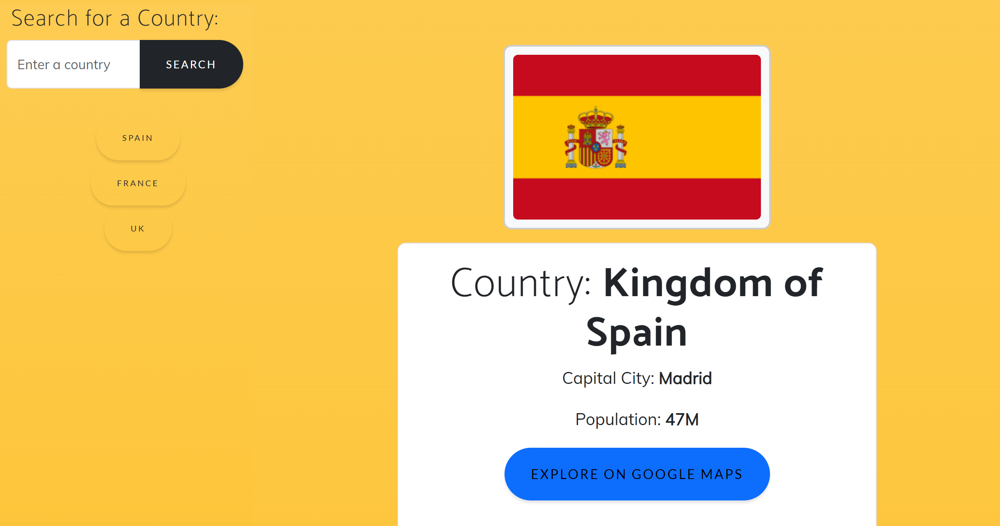

# Unscripted-Travel-Guide

We have created a travel guide website that will enable users to get a variety of current and relevant data for countries that they plan to travel to. This will not only prove to be incredibly useful but it will also be interesting. Along side the information, we have also linked a second API that fetches current pictures of the country

* Has a dashboard with form inputs.
* Allows a user to search for a country and then see the current metrics for the country.
* Allows a user to view relevant images associated with the country. 
* Allows a user to click on a country in the search history and will again be presented with the information for that country.

## Installation

To open the project please follow this link: 

## Usage 

Once you open the URL, you will see the following: https://olehprotsak.github.io/Unscripted-Travel-Guide/

If you scroll down and enter in the name of a country it will look like this:

## Badges

## Features

* Uses Bootstrap.
* Is interactive and respond to user input.
* Uses  two server-side APIs.
* Does not use alerts, confirms, or prompts (use modals).
* Uses client-side storage to store persistent data.
* Is responsive.

## Credits

We would like to refrence previous prohjects on our EdX bootcamp for providing us with the necessary skills to be able to complete this task effectivley. 

## License

MIT License

Copyright (c) [2023] [Alan Snowden, Anastasia Moraites and Oleh Protsak]

Permission is hereby granted, free of charge, to any person obtaining a copy
of this software and associated documentation files (the "Software"), to deal
in the Software without restriction, including without limitation the rights
to use, copy, modify, merge, publish, distribute, sublicense, and/or sell
copies of the Software, and to permit persons to whom the Software is
furnished to do so, subject to the following conditions:

The above copyright notice and this permission notice shall be included in all
copies or substantial portions of the Software.

THE SOFTWARE IS PROVIDED "AS IS", WITHOUT WARRANTY OF ANY KIND, EXPRESS OR
IMPLIED, INCLUDING BUT NOT LIMITED TO THE WARRANTIES OF MERCHANTABILITY,
FITNESS FOR A PARTICULAR PURPOSE AND NONINFRINGEMENT. IN NO EVENT SHALL THE
AUTHORS OR COPYRIGHT HOLDERS BE LIABLE FOR ANY CLAIM, DAMAGES OR OTHER
LIABILITY, WHETHER IN AN ACTION OF CONTRACT, TORT OR OTHERWISE, ARISING FROM,
OUT OF OR IN CONNECTION WITH THE SOFTWARE OR THE USE OR OTHER DEALINGS IN THE
SOFTWARE.